# KG Coach Dashboard

A staff-level implementation of a knowledge-graph-backed AI coach dashboard: an **AI workout generator** and a **member-context copilot**, built on two knowledge graphs grounded in clinical ontologies (SNOMED CT, OPE, COPPER, SKOS, PROV-O). Safety is enforced **deterministically** via graph traversal — the LLM never sees unsafe exercises.

---

## Table of Contents

1. [Architecture Overview](#architecture-overview)
2. [Stack & Tech-Choice Defense](#stack--tech-choice-defense)
3. [Ontology Reasoning](#ontology-reasoning)
4. [Knowledge Graph Schema](#knowledge-graph-schema)
5. [Dynamic Injury Model](#dynamic-injury-model)
6. [Multi-Member: Jordan & Mico](#multi-member-jordan--mico)
7. [Observability](#observability)
8. [Concept Resolution (3-Pass)](#concept-resolution-3-pass)
9. [Safety from Graph Traversal](#safety-from-graph-traversal)
10. [Test Rationale](#test-rationale)
11. [Worked Examples](#worked-examples)
12. [How to Run Locally](#how-to-run-locally)
13. [How AI Was Used](#how-ai-was-used)
14. [Challenges, Trade-offs, Technical Decisions](#challenges-trade-offs-technical-decisions)
15. [Production Evaluation](#production-evaluation)
16. [Nice-to-Haves Shipped](#nice-to-haves-shipped)

---

## Architecture Overview

```mermaid
flowchart TD
    subgraph Dashboard["Coach Dashboard (React + Tailwind)"]
        Login["Mock Auth\n(LoginScreen)"]
        MemberSwitcher["Member Switcher\n(Jordan / Mico)"]
        Generator["Generator Panel\nprompt + time → 1 session + gauges\n(hybrid / full-LLM toggle, streaming)"]
        Copilot["Copilot (floating drawer)\ntrainer↔AI · context-aware"]
        Inbox["Client Inbox\ntrainer↔client messages\n(deep-linked from Copilot)"]
        GraphExplorer["Graph Explorer\n(force-directed, provenance)"]
        Canvas["Creative Canvas\n3-column grid + Synthesize"]
        Analytics["Analytics\n(adherence / sleep / labs / injury)"]
        CheckIn["Injury Check-In\n(inflammation + pain triggers)"]
    end

    subgraph Backend["Agentic Runtime (FastAPI + Python)"]
        API["REST API\n/api/*"]
        Resolver["3-Pass Resolver\nexact → fuzzy → embedding"]
        Filter["Conditional Safety Filter\n(deterministic, no LLM)"]
        Assembler["Deterministic Assembler\n(hybrid engine — instant)"]
        Generator2["Generator Pipeline\nhybrid: assemble + narrate\n| full-LLM: structure_plan"]
        CopilotAgent["Copilot Agent\nLangGraph + MemorySaver + tools"]
        CorpusRAG["Corpus RAG\nsearch_corpus (MiniLM cosine\n+ keyword fallback)"]
        Synth["Workout Synthesis\n(deterministic adaptation analysis)"]
        Provenance["PROV-O Builder\nbuild_provenance()"]
        DecisionTrace["Decision Trace\nDecisionStep[] (timed)"]
    end

    subgraph KGs["Knowledge Graphs (NetworkX)"]
        KG1["KG1 — Movement/Clinical KG\nexercise · muscle · joint · pattern\nequipment · injury\nstresses / targets / requires / uses\npart-of / contraindicated-for"]
        KG2["KG2 — Member Context KG\nprofile · goals · injuries · adherence\nbiomarkers · labs · workout history\nchat history + images"]
        SharedConcepts["Shared Concept Nodes\njoints + equipment\n(same node ids in both graphs)"]
    end

    subgraph Ontologies["Ontologies"]
        SNOMED["SNOMED CT\npart-of anatomy hierarchy\nknee + lumbar subtrees"]
        SKOS["SKOS\nprefLabel / altLabel\nfor resolver"]
        PROVO["PROV-O\nActivity / Entity / Agent\nwasDerivedFrom / used"]
        OPE["OPE\nedge vocabulary\ntargets / stresses / requires"]
    end

    subgraph External["Models & Corpus"]
        LLM["Anthropic Claude\nclaude-haiku-4-5"]
        LangSmith["LangSmith\n(optional tracing)"]
        Embeddings["sentence-transformers\nall-MiniLM-L6-v2"]
        Corpus["Knowledge Corpus (vector store)\ndata/corpus.json — Zone 2, 5x5,\nHYROX, keto, TB12, ..."]
    end

    Login --> API
    MemberSwitcher --> API
    CheckIn -->|"POST /injuries/{id}/check-in"| API
    Generator -->|"POST /api/generate"| API
    Copilot -->|"POST /api/copilot/chat"| API
    GraphExplorer -->|"GET /api/graph?member_id="| API
    Canvas -->|"GET /api/exercises"| API

    API --> Resolver
    API --> Filter
    Filter --> KG1
    Filter -->|"descendants_by_part_of(joint)"| SNOMED
    API --> Generator2
    Generator2 --> Assembler
    Generator2 --> LLM
    Generator2 --> Provenance
    Generator2 --> DecisionTrace
    API --> CopilotAgent
    CopilotAgent --> KG2
    CopilotAgent --> CorpusRAG
    CorpusRAG --> Corpus
    CorpusRAG --> Embeddings
    CopilotAgent --> LLM
    CopilotAgent --> LangSmith
    Canvas --> Synth
    Synth --> KG1
    Inbox -->|"GET /copilot/.../chat-history"| API

    KG1 --- SharedConcepts
    KG2 --- SharedConcepts

    KG1 --> SNOMED
    KG1 --> SKOS
    KG1 --> OPE
    Provenance --> PROVO
    Resolver --> Embeddings
    Resolver --> SKOS
```



### Request Flow: Workout Generation

```
Coach prompt → POST /api/generate  (or /api/generate/stream for staged progress)
  → load_member_context(member_id)            # equipment, dislikes, injuries
  → conditional_safety_filter(candidates, injury, equipment, ...)   # DETERMINISTIC
       → injury.computed_phase()              # healing phase from onset_date
       → kg.descendants_by_part_of(joint)     # SNOMED part-of traversal
       → exclude exercises by movement_type   # flexion/extension/rotation/load/impact
       → equipment gate                       # requires ⊆ available_equipment
       → FilterTrace { safe, removed, substitutions, injury_state_used }
  → structure the SAFE set into ONE WorkoutPlan, by engine:
       engine="hybrid" (default, ~5s):
         → assemble_plan(...)                 # deterministic: selection, sections,
         │                                    #   sets/reps/rest, roles, templated
         │                                    #   per-exercise reasons, gauges
         → narrate_plan(...) via LLM          # writes ONLY the 4 session-level
         │                                    #   prose fields (~300 tokens)
       engine="llm" (toggle, ~18s):
         → structure_plan(...) via LLM        # the model writes the entire plan
  → build_provenance(plan, trace, ...) → ProvODocument   # PROV-O "what was filtered + why"
  → build_decision_trace(...) → DecisionStep[]           # timed, inspectable
  → set_current_plan(member_id, output)       # persisted for Copilot access
  → GeneratorOutput { variants[1], trace_summary, prov, decision_trace }
```

The session reports its own **strength / conditioning / mobility** stimulus
distribution (rendered as gauges), so a single workout replaces the older
three-variant fan-out.

---

## Stack & Tech-Choice Defense

### Backend: Python + FastAPI + NetworkX + LangChain/LangGraph

**FastAPI** was chosen for its async support (generator concurrency via `asyncio.gather`), Pydantic v2 integration (structured LLM output), and OpenAPI/docs generation. Alternatives:
- Flask: no async, less Pydantic integration
- Django: too heavyweight for a pure API layer
- Starlette: FastAPI is already Starlette with DX improvements

**NetworkX MultiDiGraph** for the knowledge graph: the graph is read-only after build, has ~200-400 nodes, and is queried with BFS traversal (`descendants_by_part_of`) not complex algorithms. NetworkX is perfectly sized for this — a full graph database (Neo4j, ArangoDB) would add operational overhead with no benefit at this scale. The MultiDiGraph supports multiple edge types between the same pair of nodes (e.g. an exercise can both `stresses` and `targets` a muscle group if that were ever needed).

**LangChain (generator) vs LangGraph (Copilot) — the key split:**

| Component | Framework | Rationale |
|---|---|---|
| Generator | LangChain `with_structured_output` | The generator is a *single structured call*: give the LLM a safe exercise list + intent directive, get back a typed `WorkoutPlan`. No tool calls, no multi-step reasoning, no branching. LangChain's chain abstraction + `with_structured_output` is the right tool — minimal overhead, maximum type safety. |
| Copilot | LangGraph agent + MemorySaver | The Copilot *is* a multi-step agent: it decides which tools to call (adherence_trend, injury_status, current_workout_plan, lab_results, ...), maintains conversation memory across turns, and may chain multiple tool calls per response. LangGraph's state machine + checkpointer handles this cleanly. |

This split avoids over-engineering: the generator doesn't need an agent loop; the Copilot does.

**Two generation engines (the speed decision).** LLM latency scales with
*output* tokens, and having the model emit the entire structured plan
(per-exercise sets/reps/rationale × N + session prose) is ~2,000 tokens → ~18s.
So the generator has two engines, switchable in the UI:

| Engine | How | Latency | When |
|---|---|---|---|
| **Hybrid** (default) | A **deterministic assembler** (`assembler.py`) builds the structure — selection, sectioning, sets/reps/rest, sequencing roles, rule-templated per-exercise reasons, and the stimulus distribution — from graph rules over the safe set. A **narrow LLM call** (`narrate.py`) then writes *only* the 4 session-level prose fields (~300 tokens). | **~5s** | default; "the graph makes the decisions, the model describes them" |
| **Full LLM** | The model structures the whole plan (`structure_plan`). | ~18s | when you want every per-exercise line model-written |

The hybrid mirrors the assessment thesis literally and is ~4× faster with no
loss of the session-level "why." Safety is identical in both — the assembler
and the LLM only ever see the post-filter safe set. (Streaming — `/api/generate/stream`
emits `resolve → safety result → structuring → plan` — makes either engine
*feel* immediate by showing the deterministic safety counts in ~1s.)

**sentence-transformers (`all-MiniLM-L6-v2`)** for the embedding pass of the resolver: fast (CPU), small (80MB), strong on short fitness phrases. Runs locally — no API cost for the resolver.

**rapidfuzz** for the fuzzy pass: Levenshtein/Jaro-Winkler with configurable threshold (90). Handles typos, pluralisation, abbreviated forms efficiently.

### Frontend: React + TypeScript + Vite + Tailwind + shadcn/ui

**React + TypeScript**: type-safe component model. Vite for fast HMR in development.
**Tailwind + shadcn/ui**: utility-first styling with accessible primitives (Dialog, Slider, Card) that map directly to the UI requirements (check-in modal, healing phase indicator, etc.).
**Recharts**: for adherence/sleep/biomarker/injury-progress charts. Composable, React-native, well-documented.
**react-force-graph**: for the Graph Explorer force-directed layout. Handles 200-400 node graphs with good performance.

---

## Ontology Reasoning

This section documents the reasoning behind each ontology choice — what we pulled in, what we left out, and why. See [`docs/SCHEMA.md`](./docs/SCHEMA.md) for the full node/edge reference.

### OPE (Open Physical Education Ontology)

**Pulled in:** The *edge vocabulary* — `targets` (exercise→muscle), `stresses` (exercise→joint), `requires` (exercise→equipment). These three relationships are the semantic core of the movement graph.

**Left out:** OPE's full OWL ontology. Investigation showed OPE is undocumented alpha: it covers 0/36 of our movement pattern categories, has 0 named equipment items matching our catalog, and the documentation is sparse. Rather than force-fitting a thin external ontology, we hand-rolled the catalog against the actual exercise data, giving 100% coverage with curated SKOS `altLabel` synonyms for the resolver. The OPE *concept* of a movement ontology (exercise→muscle→joint→equipment relationships) guided the design.

### COPPER (COgnitive-Physical PERformance Ontology)

**Pulled in:** The framing that member context includes behavioral/adherence signals alongside physical data — COPPER's personalization and behaviour-change orientation directly informed KG2's design (goals, preferences, adherence time-series, churn risk, morning brief).

**Left out:** COPPER's class tree. It has no anatomy component, so it doesn't contribute to the safety reasoning. It's a conceptual influence rather than a structural dependency.

### SNOMED CT (via NCI EVS REST API)

**Pulled in:** Real `part-of` anatomy subtrees for two injury regions:
- Knee: `72696002` (knee region) → `49076000` (knee joint) → `57714003` (patellofemoral) + tibiofemoral, menisci
- Lumbar spine: `122496007` → lumbar vertebral joints (`297179000`) → lumbar disc (`244944005`)
- Injury codes: PFPS (`57773001`), low back pain (`279039007`)

**Left out:** Everything else. SNOMED has 360,000+ concepts. We need only the anatomy subtrees for our two members' injuries. The baked snapshot (`snomed_anatomy.json`) is committed to the repo so no network access is needed at runtime.

**Why SNOMED specifically:** The `part-of` hierarchy is the load-bearing safety invariant. It ensures that a "knee injury" automatically excludes exercises stressing *any* component of the knee complex (patellofemoral, tibiofemoral, medial meniscus) — not just exercises that mention "knee." SNOMED has the best available machine-readable anatomy `part-of` hierarchy with stable identifiers.

### PROV-O (W3C Provenance Ontology)

**Pulled in:** `prov:Activity` (the generation run), `prov:Entity` (each exercise in the plan), `prov:Agent` (the system), `prov:wasAssociatedWith`, `prov:wasDerivedFrom`, `prov:used`, `prov:startedAtTime`/`prov:endedAtTime`.

**Left out:** Full JSON-LD serialisation with `@context`. The documents are PROV-O-shaped JSON — the term names are preserved (`prov:type`, `prov:wasDerivedFrom`) so the ontology lineage is clear, but we don't require an RDF reasoner.

**Why PROV-O:** Assessment requirement R1 — every plan carries a provenance trace explaining *why* each exercise was chosen and *what was filtered out*. PROV-O gives us the right vocabulary (derived from, used, associated with) for this. It's also extensible: the `filtered_out` entries carry `graph_path` (the SNOMED traversal that justified exclusion) and `injury_constraint` (the specific movement type or phase rule that fired).

### SKOS (Simple Knowledge Organization System)

**Pulled in:** `prefLabel` (canonical display name) and `altLabel` (synonyms for resolution) on every concept node. Used as the join key between free-text and canonical concept ids.

**Left out:** SKOS broader/narrower/related/seeAlso. Hierarchy comes from SNOMED `part-of`; we don't need a second hierarchy mechanism.

### How the two graphs relate

Both KG1 and KG2 are built from the same canonical concept catalog. **Joint concept ids** (e.g. `"knee"`, `"lumbar_spine"`) and **equipment concept ids** (e.g. `"kettlebell"`) are shared across both graphs — they are the same graph node ids. This means:

- When a member has a `"knee"` injury, the `conditional_safety_filter` can traverse KG1's `part-of` hierarchy from the `"knee"` node to find all descendant anatomical nodes, then find all exercises that `stresses` any of those nodes.
- When a member has `"kettlebell"` in their equipment list, the filter resolves this to the same concept id used in KG1's `requires` edges.

No join on free text — the taxonomy strings ARE the vocabulary, and they resolve to stable graph node ids.

---

## Knowledge Graph Schema

Full reference: [`docs/SCHEMA.md`](./docs/SCHEMA.md)

### KG1 — Movement/Clinical KG (quick reference)

| Edge | Meaning |
|---|---|
| `stresses` | exercise → joint: loads this joint with specific movement types (flexion/extension/rotation/load/impact) |
| `targets` | exercise → muscle: primary/secondary stimulus for this muscle group |
| `requires` | exercise → equipment: cannot be performed without this equipment |
| `uses` | exercise → pattern: belongs to this movement pattern category |
| `part-of` | body_region → parent: SNOMED anatomical containment (the safety traversal edge) |
| `contraindicated-for` | injury_concept → exercise: static textbook contraindication |

### KG2 — Member Context KG (quick reference)

Member nodes link to: injuries, equipment, adherence series, coach brief, biomarkers, goals, preferences, labs, workout history, chat history.

The `injury` node in KG2 uses the same joint slug as the `joint` node in KG1 — this is how the two graphs connect at runtime.

---

## Dynamic Injury Model

Injuries are not binary ("injured or not"). The system models the full recovery arc:

### Healing Phases

| Phase | Days since onset | Movement restrictions | Max load tolerance |
|---|---|---|---|
| Acute | 0–7 | Exclude: load, impact, rotation | 0% |
| Subacute | 7–21 | Exclude: impact | 30% |
| Remodeling | 21–90 | Exclude: none at phase level | 70% |
| Return-to-Activity | 90+ | None | 100% |

Phase is computed automatically from onset date. Coaches/PTs can override via `PATCH /api/members/{id}/injuries/{id}/phase`.

### Daily Check-In

Members log today's injury state via the Check-In modal:
1. **Inflammation level**: none / mild / moderate / severe
2. **Pain triggers**: checkboxes for flexion / extension / rotation / load / impact
3. **Subjective pain**: 0–10 slider
4. **Load tolerance**: 0–100% of normal intensity

The check-in drives the *dynamic* filter: if today's check-in reports "pain on flexion," the system excludes all exercises that perform flexion at the injured joint, regardless of healing phase. If no check-in today, the system uses the most recent state with a `stale_check_in` warning.

### Example

Jordan's check-in on 2026-06-06: `inflammation: none, pain_on: [flexion], subjective_pain: 2, load_tolerance_pct: 0.7`

- Phase: Remodeling (day 27 of 21–90 range)
- Phase restrictions: no phase-level movement exclusions
- Dynamic exclusion: exercises performing `flexion` at `knee` or any SNOMED descendant of `knee`
- Effective load cap: `min(0.7, 1.0)` = 70%

Result: squats (knee flexion) excluded; leg extensions (knee extension only) retained; all exercises intensity-capped at 70%.

---

## Multi-Member: Jordan & Mico

The system serves two fully fleshed-out synthetic members. A mock coach login (username/password, hardcoded credentials, stub JWT token) gates the dashboard; the member switcher re-keys all hooks.

### Jordan Rivera

- 28yo recovering athlete, mild left-knee PFPS (onset 2026-05-10, remodeling phase)
- Home gym: Dumbbell, Kettlebell, Yoga Mat, Resistance Band - Loop, Flat Bench (5 items — no barbell)
- Goals: lower-body strength, return to pain-free squatting, sleep improvement
- Adherence: declining — elevated churn risk flag in coach brief
- Check-in history: two entries showing inflammation trending down

### Mico

- 35yo former gymnast turned tech founder, hormone optimization + HYROX performance
- Full commercial gym + rig/rings (25+ equipment items)
- Injury: mechanical low-back pain (lumbar spine, onset 2025-11-01, RTA phase)
- Pain triggers: flexion + load at lumbar spine
- High adherence, low churn risk
- Biomarkers: testosterone, cortisol, HRV/RHR panels

Both members use the **same** conditional safety filter logic — the `part-of` traversal from `knee` vs `lumbar_spine` is the only difference. This validates the anatomy-agnostic design.

---

## Observability

### LangSmith (external — LLM reasoning)

Enable with environment variables:
```
LANGCHAIN_TRACING_V2=true
LANGCHAIN_API_KEY=ls__...
LANGCHAIN_PROJECT=kg-coach-dashboard
```

When enabled:
- The generator's 3 `structure_plan` LLM calls each appear as named, tagged traces in LangSmith (run_name: `"structure_plan"`, metadata: `member_id`, `variant_id`, `prompt`)
- Copilot agent runs appear as full agent traces with tool call history
- Degrades gracefully when not configured — no crash, tracing silently off

### In-App Decision Trace (internal — deterministic graph decisions)

Every `GeneratorOutput` carries a `decision_trace: list[DecisionStep]` that the frontend renders in the DecisionTrace panel. Steps:

| Step | Kind | What it records |
|---|---|---|
| `resolve_prompt` | deterministic | Concept extraction from the coach's prompt |
| `load_constraints` | deterministic | Member equipment count, dislikes, injury joint |
| `part_of_traversal` | deterministic | SNOMED descendants of the injured joint |
| `movement_type_exclusion` | deterministic | Which movement types were excluded and why |
| `equipment_gate` | deterministic | How many exercises removed for missing equipment |
| `llm_structuring` | llm | Safe count, variants structured, LangSmith link if enabled |

The frontend can show "this plan was designed by a system that excluded 12 exercises for knee safety (via SNOMED traversal) before the LLM ever saw the exercise list."

---

## Concept Resolution (3-Pass)

The resolver (`backend/app/resolver/resolver.py`) maps free-text terms from the coach's prompt to canonical concept ids in the catalog. Three passes with explicit confidence thresholds:

```
resolve("posterior chain")
  Pass 1 — Exact:     no match
  Pass 2 — Fuzzy:     rapidfuzz score = 88 < 90 threshold → no match
  Pass 3 — Embedding: cosine("posterior chain", "Hamstrings") = 0.82 > 0.72 → MATCH
  → Resolution(status="resolved", concept="hamstrings", confidence=0.82, pass_used="embedding")

resolve("squat")
  Pass 1 — Exact:     "squat" in altLabels of "lower_push_squat" → MATCH
  → Resolution(status="resolved", concept="lower_push_squat", confidence=1.0, pass_used="exact")

resolve("bad lower back")
  Pass 3 — Embedding: cosine("bad lower back", "Lumbar Spine") = 0.79 → MATCH
  → Resolution(status="resolved", concept="lumbar_spine", confidence=0.79, pass_used="embedding")
```

Graceful degradation: if confidence < threshold and no match, returns `Resolution(status="no_match")`. The generator continues without that concept constraint rather than failing.

---

## Safety from Graph Traversal

The core safety invariant: **the LLM never sees unsafe exercises**. Safety is enforced by a pure deterministic function before any LLM call.

The traversal for "knee injury, pain on flexion":

```
1. injury.joint = "knee"
2. kg.descendants_by_part_of("knee")
   → SNOMED traversal from code 49076000:
     → 57714003 (patellofemoral_joint)
     → 182204001 (tibiofemoral_joint)
     → 59440001 (medial_meniscus)
     → 64927001 (lateral_meniscus)
     → + catalog slug "knee"
   → injured_node_ids = {"knee", "49076000", "57714003", "182204001", ...}

3. For each candidate exercise:
   - Check stresses edges to any node in injured_node_ids
   - If edge has movement_types ∩ {flexion, load, ...} ≠ ∅ → REMOVE
   - Reason: "movement type(s) ['flexion'] excluded at injured joint 'Knee Joint' (phase: remodeling; pain on: ['flexion'])"

4. Equipment gate:
   - exercise.equipment_required ⊆ available_equipment → KEEP
   - else → REMOVE with reason "requires unavailable equipment: Barbell"
```

The `conditional_safety_filter` is a pure function (no network, no LLM, no side effects) that returns a `ConditionalFilterTrace` with `safe`, `removed`, and `substitutions` lists. It runs exactly once per generate/refine call. The PROV-O builder then explains every removal decision.

**Static `contraindicated-for` edges** are materialized in the graph at build time from a clinical rules table (knee injury → avoid flexion/impact/load; lumbar injury → avoid flexion/load/rotation). These power the Graph Explorer's "show filtering" view. The runtime authority remains the dynamic filter with today's injury state.

---

## Test Rationale

The test suite prioritizes the two critical paths that must never fail:

### Why the Concept Resolver (`tests/test_resolver.py`)

The resolver is the system's *input parser*. Every coach prompt goes through it. If it fails silently (wrong concept, no match when there should be a match), the generator produces a plan that doesn't reflect what the coach asked for. Failure modes:

- A fuzzy match returns "shoulder" when "squat" was intended → wrong exercises selected
- Embedding pass returns a false positive → a disallowed constraint silently applied
- Threshold misconfiguration → all terms return "no_match" → unconstrained generation

The tests cover: exact match, fuzzy match, embedding fallback, no-match degradation, and threshold edge cases. These invariants cannot degrade gracefully — they must be correct.

### Why the Safety Filter (`tests/test_safety_filter.py`, `tests/test_conditional_filter.py`)

The safety filter is the system's *safety gate*. If it passes an unsafe exercise to the LLM, that exercise will almost certainly appear in the generated plan. The LLM is not a safety mechanism — it structures what it's given. Failure modes:

- A knee-flexion exercise appears in Jordan's plan → direct harm risk
- A lumbar-loading exercise appears in Mico's plan → direct harm risk
- Equipment gate fails → plan includes exercises the member can't perform

The tests cover: knee/lumbar injury exclusion invariants, equipment gate, explicit excludes, dislikes, load tolerance propagation, stale check-in handling, healing phase restrictions, and coach phase override. These are safety invariants: every generated plan must pass them.

Everything else (LLM structuring quality, provenance formatting, chart rendering) degrades gracefully — a poorly-structured plan is annoying; an unsafe plan is harmful.

---

## Worked Examples

> The values below are **real output from the running system** (hybrid engine),
> not illustrative — captured via `POST /api/generate`.

### Example A — Injury **and** limited-equipment case · Jordan (left knee, home gym)

**Setup:** Jordan — left-knee PFPS, *remodeling* phase, today's check-in `pain_on: [flexion]`, `load_tolerance: 70%`; home gym = dumbbells + kettlebell + bands (**no barbell, no rack, no machines, no pull-up bar**).

**Prompt:** `"lower body strength"` · 45 min

**Filtering trace — 17 safe / 54 removed**, two gates visible at once:

```
INJURY (part-of + movement-type)  — 32 removed, e.g.:
  Kettlebell Goblet Cyclist Squat :: movement type(s) ['flexion'] excluded at
      injured joint 'Knee' (phase: remodeling; pain on: ['flexion'])
  RNT Split Squat                 :: ['flexion'] excluded at 'Knee' ...
  Static Jump / Med Ball Scoop Toss :: ['flexion'] excluded at 'Knee' ...

EQUIPMENT GATE — e.g.:
  Barbell Decline Bench Press     :: requires unavailable equipment: Barbell, Rack, Plate
  Isometric Pull-Up               :: requires unavailable equipment: Pull-Up Bar
  Machine - Single-Arm Lat Pull-Down :: requires unavailable equipment: Lat Pulldown Machine
```

**Resulting plan** (knee-safe, barbell-free, 70% load cap applied):

| Section | Exercises |
|---|---|
| Warmup | High Plank Bird Dog (2×40s), Walking Toe Touches (2×12), Ground Upper Trap Stretch (2×40s) |
| Main | One-Kettlebell Hamstring Walkout (4×40s), Farmers Carry (4×40s), Dumbbell Suitcase Carry (4×40s), Single-Arm KB Rack Carry (4×40s), Push-Up to Knee-Drive (4×5) |
| Cooldown | Standing Neck Circles (1×40s) |

**Stimulus gauges:** strength 23 · conditioning 56 · mobility 36. Note the plan
contains **zero knee-flexion movements** and **zero barbell movements** — the
LLM never saw them, because the deterministic filter removed all 54 before
structuring. This single example satisfies both the *injury* and the
*limited-equipment* requirement.

---

### Example B — Second injury case · Mico (lumbar spine, full gym)

**Setup:** Mico — desk-induced mechanical low-back pain; full gym access. The
intent (pre-filled from his morning brief) is to *avoid loaded lumbar flexion*.

**Prompt:** `"upper body strength and conditioning"` · 50 min

**Filtering trace — 40 safe / 31 removed.** The lumbar exclusions show the
**conservative-exclusion fallback**: exercises that stress the lumbar spine but
lack a movement-type annotation are removed anyway (fail-safe), not assumed safe:

```
INJURY (part-of, conservative) — 12 removed, e.g.:
  Walking Toe Touches   :: stresses injured joint 'lumbar_spine'
      (no movement-type annotation; conservative exclusion)
  Sandbag Lunge         :: stresses injured joint 'lumbar_spine' (conservative)
  Rowing Ergometer / SkiErg Sprint :: stresses 'lumbar_spine' (conservative)
```

Same `conditional_safety_filter` function as Jordan's knee — only the injured
joint, its SNOMED `part-of` subtree, and today's check-in differ. The safe set
that reaches the assembler/LLM is upper-body and core-stable by construction.

---

### Example C: Healing Progression — Acute vs Remodeling

**Same injury (knee PFPS), different day:**

| Phase | Day | Phase restrictions | Pain-on | Safe exercises |
|---|---|---|---|---|
| Acute | Day 3 | Exclude: load, impact, rotation; max load 0% | flexion | Quad sets, seated knee extension, foam roll quad, hip CARs |
| Remodeling | Day 27 | None (phase floor); max load 70% | flexion | All non-flexion knee exercises at ≤70% load |

The same `conditional_safety_filter` function handles both — the healing phase determines the floor restrictions, today's `pain_on` adds the dynamic layer on top.

---

### Example D: Equipment substitution

Beyond removal, the filter records substitutions in `FilterTrace.substitutions`
(surfaced in the Provenance panel): a removed exercise is matched to a safe one
sharing its movement pattern + primary muscle — e.g. **Barbell Romanian
Deadlift** → **Kettlebell Single-Leg RDL** (`lower_pull_hip_lift`, hamstrings).

---

### Example E: Copilot grounded follow-up (+ deep-link + corpus)

**Coach:** "What's the primary stimulus of the plan we just made — and is Zone 2 worth adding for him?"

The Copilot (the floating drawer — a trainer↔AI conversation, **separate** from the trainer↔client Inbox):
1. Calls `current_workout_plan(member_id)` → reads the stored plan + its stimulus distribution.
2. The "is Zone 2 worth it" half is **generic knowledge**, so it calls `search_corpus("zone 2")` → grounds the answer in the corpus doc (cites "Zone 2 Training"), rather than inventing it.
3. When it references a past **client** message it appends a `[[msg:<ts>]]` token, rendered as a clickable chip that opens the **Client Inbox** at that exact message.

The Copilot never invents member data — every fact traces to a KG tool return; if the KG lacks a datum it says so. Generic training/diet/competition questions are grounded in the corpus, and **safety is never RAG** — it stays deterministic graph traversal.

---

## How to Run Locally

### One command — Docker (recommended)

From the repository root:

```bash
cp .env.example .env          # set ANTHROPIC_API_KEY=sk-ant-...
docker compose up --build     # → http://localhost:8080
```

That's the whole thing. The stack is **self-contained**: the seed JSON is baked
into the backend image (no external database), and the `all-MiniLM-L6-v2`
embedding model is downloaded once on first boot into a cached volume. The
frontend (nginx) serves the built SPA and proxies `/api` to the backend.

Open **`http://localhost:8080`** and sign in with **any email + any password**
(mock auth — see `LoginScreen` / `/api/auth/login`).

> Port 8080 is chosen so it never collides with a local dev server on 5173/8000.

### Alternative — local dev (`make dev`)

For hot-reload development without Docker:

```bash
make setup        # uv sync (backend) + npm install (frontend)
make dev          # FastAPI :8000 + Vite :5173  → http://localhost:5173
```

Requires **Python 3.12+** with [uv](https://github.com/astral-sh/uv) and **Node 20+**.

### Environment Variables

```bash
# Required for workout generation and Copilot
ANTHROPIC_API_KEY=sk-ant-...

# Optional: LangSmith tracing
LANGCHAIN_TRACING_V2=true
LANGCHAIN_API_KEY=ls__...
LANGCHAIN_PROJECT=kg-coach-dashboard
```

### Makefile targets

| Target | What it does |
|---|---|
| `make setup` | Install backend (uv) + frontend (npm) dependencies |
| `make dev` | Start backend (port 8000) + frontend (port 5173) concurrently |
| `make backend` / `make frontend` | Start one side only |
| `make test` | Run full pytest suite |
| `make check` | Run tests + frontend build + typecheck |

### Running tests only

```bash
cd backend && uv run pytest -q
```

Tests cover the two load-bearing, LLM-independent paths — the **concept
resolver** (`test_resolver.py`) and the **safety filter**
(`test_safety_filter.py`, `test_conditional_filter.py`) — plus the member KG,
generator, graph endpoint, provenance, and the **RAG corpus** (`test_rag.py`).

---

## How AI Was Used

This project was built using Claude (Anthropic) as an AI pair programmer throughout:

- **Architecture design**: Claude helped reason through the two-KG design, the LangChain vs LangGraph split, and the SNOMED part-of traversal as the safety mechanism.
- **Ontology grounding**: Claude helped identify which ontology vocabulary was worth pulling (OPE edge vocabulary, SNOMED anatomy hierarchy, SKOS labels, PROV-O for provenance) vs what was too complex or misaligned.
- **Code generation**: All Python modules, TypeScript components, and test files were written with Claude's assistance, iteratively refined against type errors and test failures.
- **Test design**: Claude helped design the critical-path tests — specifically the safety invariant tests that must hold regardless of LLM behavior.
- **Data annotation**: The `exercise_movements.json` joint-movement annotations (which exercises perform flexion/extension/rotation/load/impact at which joints) were initially drafted with Claude's help, then reviewed for clinical accuracy.
- **README and SCHEMA.md**: Written with Claude, grounded in the actual codebase (not invented).

- **Iterative, verified build**: the UI was built and refined in tight loops where the agent drove a headless browser, screenshotted the result, and corrected against the rendered output (design fidelity, the check-in chart, the canvas grid, the engine toggle) rather than coding blind.
- **Decision documentation**: where the spec was ambiguous (single vs. multi injury, `is_duration` data quality, hybrid vs. full-LLM, corpus RAG vs. Neo4j), the reasoning was written down — see *Challenges, Trade-offs, Technical Decisions* — because that reasoning is part of the deliverable.

Where AI assistance was used, the output was reviewed for correctness — especially for the safety filter logic, SNOMED traversal, and clinical reasoning. The deterministic safety path is guarded by the test suite (`test_safety_filter.py`, `test_conditional_filter.py`); the LLM is never the safety boundary.

---

## Challenges, Trade-offs, Technical Decisions

### Challenge 1: Movement-type annotation effort

The safety filter needs to know *which* movement types each exercise performs at *which* joint. This requires per-exercise annotation (`data/exercise_movements.json`). For ~80 exercises, this is substantial manual work. We prioritised high-yield exercises (compounds like squats, deadlifts, bench press, rows) and used conservative fallback logic for unannotated exercises: if an exercise stresses an injured joint with no movement-type annotation, it is conservatively excluded.

**Trade-off:** Conservative exclusion may remove safe exercises. A more precise annotation would reduce false positives. The annotation file is designed for ongoing improvement — adding an annotation immediately makes the filter more precise for that exercise.

### Challenge 2: LLM structuring quality vs. determinism

The generator makes a structured LLM call to turn a safe exercise list into a WorkoutPlan. The LLM output quality varies — sometimes `sequencing_rationale` is generic, sometimes the `order` fields are not consecutive. We addressed this by:
- Using `with_structured_output(WorkoutPlan, strict=True)` for JSON schema enforcement
- Detailed system prompt with explicit sequencing principles
- Validation at parse time via Pydantic

**Trade-off:** We can't guarantee LLM output quality without evaluation harnesses. The safety gate is deterministic; plan quality is best-effort with structured output constraints.

### Challenge 3: Embedding boot time

`all-MiniLM-L6-v2` takes ~3-5 seconds to load on first boot. We precompute embeddings at startup and cache them (LRU). The model is only ~80MB but the torch import adds overhead.

**Trade-off:** Cold start latency. Acceptable for a dev/demo environment; in production this would be a dedicated embedding service with warm startup.

### Challenge 4: SNOMED CT access

The NCI EVS REST API is public but throttled. We bake the anatomy snapshot to `snomed_anatomy.json` at development time via `scripts/fetch_snomed.py` and commit it. This eliminates runtime network dependency.

**Trade-off:** The snapshot is a point-in-time snapshot. SNOMED updates don't automatically flow in. Acceptable for the fixed injury types in scope (knee PFPS, lumbar back pain).

### Challenge 5: Generation latency (the 18s problem)

A single full-plan LLM call is ~18s because the model emits the entire
structured plan. Rather than accept that or strip the detail, we split the work:
a **deterministic assembler** builds the plan from graph rules and a **narrow LLM
call** writes only the session prose (~5s). **Trade-off:** the hybrid's
per-exercise reasons are rule-templated (good, but more generic than
model-written), so we kept the full-LLM path behind a toggle for when richer
per-line prose is wanted. We did **not** adopt a graph database for speed (a
competing approach) — at ~100 nodes that would be operational weight without
payoff, and it contradicts the in-process thesis.

### Decision: ambiguous `is_duration` data → infer from name/pattern

The seed `exercises.json` flags almost every exercise `is_duration: true`
(including barbell presses), so that field is unreliable. Rather than trust it,
the assembler infers time-vs-reps work from the exercise name/pattern
(holds, planks, stretches, carries, isometrics). Documented here because it's a
judgement call the data forced.

### Decision: corpus RAG is an *enhancement*, never a safety path

We added a small program/diet/competition knowledge corpus (`data/corpus.json`)
so the Copilot can ground open-ended questions ("what is Zone 2?"). It uses
cosine over the MiniLM embeddings we already load (embeddings *on* by default,
keyword fallback). **Safety, selection, contraindications, and provenance remain
deterministic graph traversal — never RAG.** A reviewer comparing us to a
one-store Neo4j build will see we keep the safety-critical path local and
deterministic by design.

### Decision: In-memory store (no database)

All member check-ins and generated plans are stored in-memory (Python dicts) per server instance. This is intentional per the scope: "in-memory/stubbed per the design's 'mock auth is fine' scope." The API surface is designed for easy database substitution — the `store.py` module could be backed by Redis or PostgreSQL with minimal interface change.

### Decision: Single injury per member

The current model uses the first injury from each member's profile. Multiple simultaneous injuries (e.g. knee + shoulder) would require a union of all injured joint descendants. The filter logic already supports this — `conditional_safety_filter` takes one `Injury` object; a multi-injury version would call it once per injury and union the removed sets.

---

## Production Evaluation

### Metrics

| Metric | Target | Measurement |
|---|---|---|
| Safety filter precision | 100% — no contraindicated exercise ever passes | Adversarial test suite: for every injury type × movement type combination, assert the filter removes the corresponding exercises |
| Safety filter recall | 0 false positives — no safe exercise incorrectly removed | Sample safe exercises per injury configuration, verify inclusion |
| Concept resolver accuracy | >95% on curated prompt benchmark | Manual-labeled test prompts vs. resolved concepts |
| Recommendation quality | Coach rating ≥4/5 on structured rubric | Coach feedback loop |
| Generation latency | hybrid p50 ~5s / full-LLM ~18s; deterministic stages <5ms | per-phase timings in the decision trace (`duration_ms`); LangSmith for LLM spans |
| Token efficiency | hybrid narration ~300 output tokens vs ~2,000 full-LLM | LangSmith token counts; trade output for latency via the engine toggle |
| Copilot groundedness | 0 fabricated member data items | Tool-call logging: all facts must trace to a tool return value |

### Failure Modes

| Failure | Detection | Mitigation |
|---|---|---|
| LLM returns a contraindicated exercise | The LLM receives only the safe set — it can only reference exercises from that set | Safety filter runs before LLM; LLM cannot introduce new exercises not in the prompt |
| Stale check-in drives incorrect filtering | `stale_check_in: true` flag surfaced in UI | Coach sees "Using check-in from yesterday, update?" banner |
| Resolver returns wrong concept | Low-confidence resolution logged; graceful degradation to unconstrained | Confidence threshold + test suite on curated prompts |
| Missing movement-type annotation → conservative exclusion | `conservative exclusion` reason in removed list | Annotation improvement is additive; test suite verifies all annotated exercises |
| LLM API timeout or rate limit | `asyncio.gather` propagates exception; endpoint returns 503 | Retry logic + fallback message to coach |

### Safety Monitoring

In production: every `ConditionalFilterTrace.removed` entry is logged with member_id, exercise_id, reason, and injury_state. An alert fires if any exercise that was historically in the `removed` list appears in a new `safe` list for the same member without a corresponding injury state change. The safety filter is the last line of defense — its decisions should be auditable.

---

## Nice-to-Haves Shipped

All of the following were implemented beyond the minimum requirements:

- **Hybrid generation engine** — deterministic assembler + narrow LLM narration (~5s) with a UI toggle to the full-LLM engine; ~4× faster (see Stack section).
- **Streaming generation** — `POST /api/generate/stream` emits staged progress (resolve → safety counts in ~1s → structuring → plan) so the coach gets feedback instead of a blank wait. Copilot chat also streams.
- **Corpus RAG** — a program/diet/competition knowledge corpus the Copilot retrieves over for open-ended questions (`search_corpus`, MiniLM cosine + keyword fallback); strictly an enhancement, never a safety path.
- **Copilot as a floating drawer + Client Inbox** — the Copilot (trainer↔AI) is separated from the trainer↔client message Inbox; the Copilot deep-links to specific client messages via `[[msg:<ts>]]` chips, and is aware of the morning brief + chat history via tools.
- **Workout Synthesis** — the Creative Canvas can analyze a coach-built workout deterministically and report its *actual* training adaptation (e.g. "you built strength but the rep/rest scheme reads as hypertrophy"), so intended vs. actual is visible.
- **Single session + stimulus gauges** — one workout that reports its own strength/conditioning/mobility distribution, replacing the older 3-variant fan-out; context-aware regenerate feeds the prior plan back to the model.
- **Graph Explorer** — interactive force-directed KG1 view with search, type filters, click-to-explain, and member-aware filtering that **names the specific injury** behind each exclusion.
- **Docker one-command deploy** — `docker compose up --build` → a self-contained stack on `:8080` (seed data baked in, model cached in a volume, nginx proxy).
- **LangSmith observability** — full tracing of generator LLM calls and Copilot agent runs, with named traces and metadata tags for filtering in LangSmith.
- **Deeper SNOMED anatomy** — both knee (5 sub-structures) and lumbar spine (3 sub-structures) are covered by real SNOMED `part-of` hierarchies.
- **Longitudinal reasoning** — adherence time series, injury state history, and biomarker trends are all stored as KG2 nodes that the Copilot retrieves for trend analysis.
- **HYROX/hybrid catalog** — 30+ hybrid movements (sled push/pull, SkiErg, wall ball, farmers carry, sandbag lunge) with conditioning block formats (intervals, AMRAPs, station bricks).
- **Creative Canvas** — n8n-style exercise builder where coaches compose sessions manually, with safety-aware contraindication warnings per member.
- **Mock coach auth** — a lightweight login gate (hardcoded coach credentials, stub JWT) that separates the unauthenticated login screen from the authenticated dashboard.
- **Multi-member with full profiles** — Jordan (knee, home gym, churn risk) and Mico (lumbar, full gym, HYROX) with distinct injury profiles, equipment sets, labs (blood panel + DEXA), and biomarkers.
- **PROV-O provenance** — formal PROV-O-shaped provenance documents per variant, with `filtered_out` entries carrying the graph traversal path and injury constraint.
- **Refine endpoint** — `PATCH /api/generate/refine` accepts natural-language adjustments ("exclude deadlifts", "no barbell", "add more core") and re-runs the full pipeline with updated constraints.
