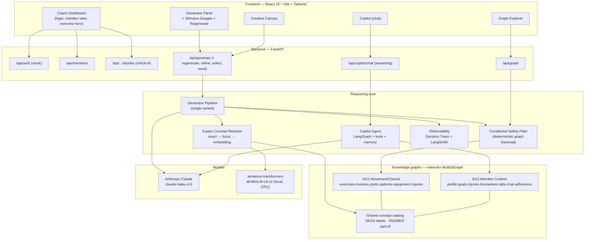
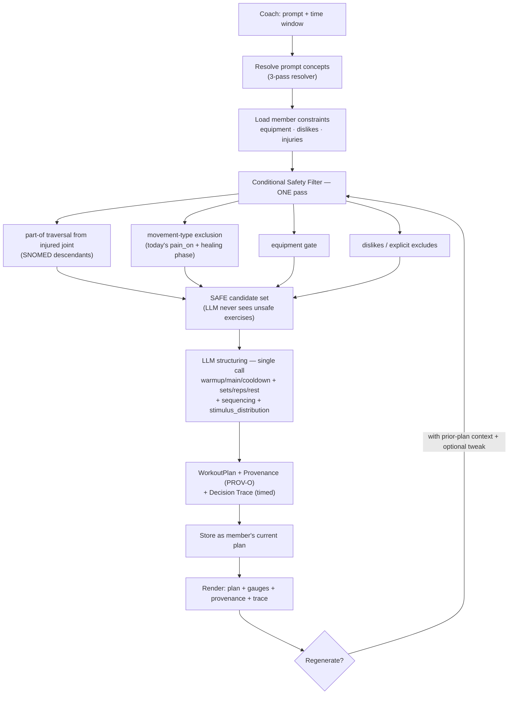
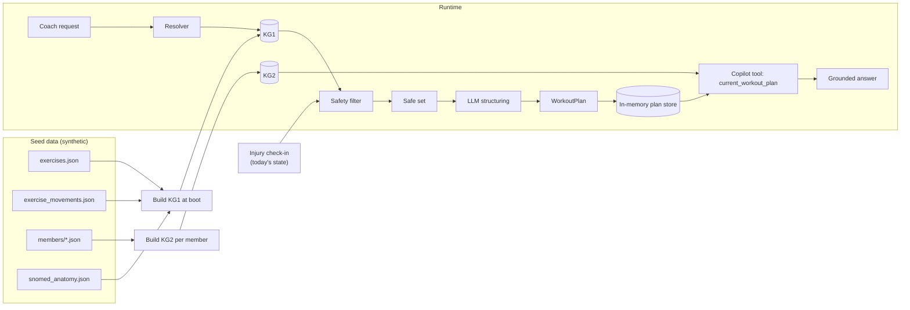
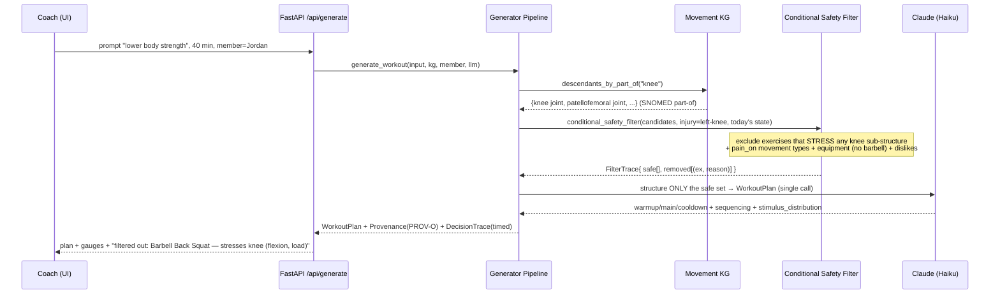
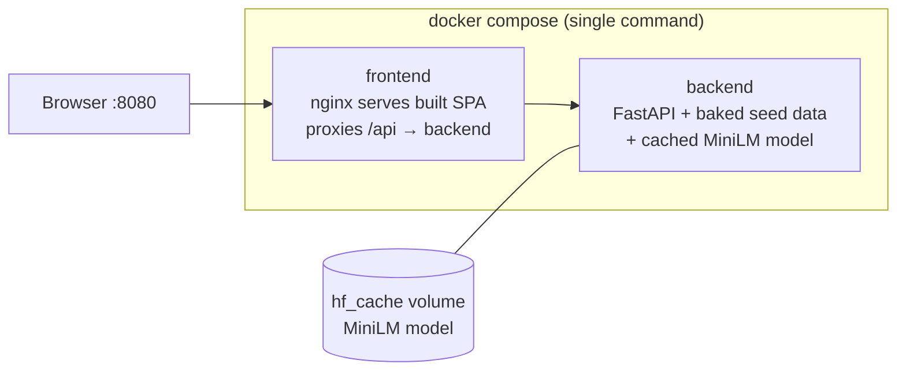

# Architecture — Knowledge-Graph-Backed Coach Dashboard

How the system is put together, how a request flows through it, and the
architecture-level decisions behind it. Companion to the deep ontology
write-up in `graph-design-decisions.html` and the requirements in
`requirements.md`.

**One-line thesis:** the **graph does the work the prompt cannot** — concept
resolution and safety are **deterministic graph operations**; the LLM only ever
sees an already-safe candidate set and structures it into a session.

---

## 1. System architecture

**Key structural fact:** KG1 and KG2 **share the same concept nodes** (e.g.
`joint:knee`, `equipment:barbell`). That shared vocabulary is the join key —
the member's injury and the exercise catalog meet at a canonical graph node, so
there is **no free-text matching at runtime**.

---

## 2. Component responsibilities

| Layer | Component | Responsibility |
|-------|-----------|----------------|
| **Frontend** | Dashboard / hooks (`useGenerator`, `useCopilot`, `useInjury`, `useGraph`) | Render surfaces; typed `fetch` wrappers in `lib/api.ts`; per-member state. |
| **API** | FastAPI routers | Thin HTTP boundary; typed Pydantic request/response; no business logic. |
| **Resolver** | `resolver/` | Free text → canonical concept. 3 passes with confidence thresholds; `low_confidence`/`no_match` degrade gracefully. |
| **Safety** | `graph/safety_filter.py`, `graph/conditional_filter.py` | **Deterministic** exclusion by `part-of` traversal + today's injury state + equipment + dislikes. Runs **once** per generation. |
| **Generator** | `generator/pipeline.py`, `generator/llm.py` | Filter → **single** LLM structuring call (`with_structured_output → WorkoutPlan`) → provenance + decision trace. |
| **Copilot** | `copilot/agent.py` | LangGraph agent; tools retrieve over KG2; `MemorySaver` checkpointer keyed by `member_id`; `current_workout_plan` tool makes it workout-aware. |
| **Graphs** | `graph/movement_kg.py`, `graph/member_kg.py` | `networkx.MultiDiGraph`; traversal helpers (`descendants_by_part_of`, `exercises_stressing`). |
| **Ontology** | `ontology/` | SKOS concept catalog; baked `snomed_anatomy.json` (`part-of` subtree); loaders. |
| **Observability** | `observability/` | In-app `DecisionStep[]` trace (with per-phase timings) + optional LangSmith run links. |
| **Stores** | in-memory dicts | Plan store (per-member current plan), injury check-in store, workout-send store. Process-lifetime. |

---

## 3. Workout-generation workflow

**Why one filter, one LLM call.** The safety filter is the load-bearing,
deterministic step and runs exactly once. The coach's prompt already sets the
modality, so the generator makes a **single** structuring call (not three) — the
plan reports its own strength/conditioning/mobility **stimulus distribution**,
shown as thermometer gauges. Regenerate re-enters the same pipeline but feeds
the previous session to the LLM so the result is a fresh, distinct variation.

---

## 4. Data flow (read paths + write paths)

- **Boot:** graphs are constructed from synthetic JSON; the MiniLM embedding
  corpus is precomputed once. SNOMED `part-of` is **baked**, not fetched live.
- **Per request:** resolve → traverse → filter → structure. The only network
  hop is to the LLM.
- **State:** check-ins, the current plan, and sends live in process-lifetime
  in-memory stores (no DB by design — synthetic, single-process, fast to reason
  about).

---

## 5. Use-case flow — "Her left knee is bothering her"

The canonical injury scenario (Jordan Rivera, recovering left-knee PFPS), end to
end:

**What the coach sees:** a knee-safe session, the **stimulus gauges**, and a
**provenance trace** naming each excluded exercise, the **specific injury** it
was excluded for, and the graph reason (e.g. *"Barbell Back Squat — excluded for
left knee (PFPS): stresses patellofemoral joint via part-of; pain on
flexion+load"*). No part of this is a prompt instruction — it is graph traversal.

---

## 6. Architecture-relevant decisions

Condensed from `graph-design-decisions.html` (full reasoning + trade-offs there).

| Decision | Choice | Why it's an architecture decision |
|----------|--------|-----------------------------------|
| **Graph store** | `networkx.MultiDiGraph` in-process | No external DB; the dataset is ~100 nodes. MultiDiGraph supports parallel typed edges (`stresses`, `targets`, `requires` between the same pair). Traversal is a library call, not a query language. |
| **Two graphs, one vocabulary** | KG1 + KG2 share concept nodes | The join key for member↔catalog reasoning. Injury (KG2) and exercise (KG1) meet at `joint:knee` — no runtime fuzzy join. |
| **Safety = traversal** | `part-of` descent + movement-typed `stresses` | Deterministic, reproducible, auditable. The LLM is structurally prevented from seeing unsafe exercises. |
| **Movement-typed `stresses`** | edges carry `flexion/extension/rotation/load/impact` | Lets the filter exclude by **today's** pain triggers, not just "knee is injured" — state-aware safety. |
| **`contraindicated-for` as a stored edge** | materialized baseline + dynamic filter | Static "textbook" view powers the Graph Explorer; the conditional filter remains the live runtime authority. |
| **SNOMED baked, not live** | `snomed_anatomy.json` snapshot | Determinism + offline + no API dependency on a safety path. |
| **Concept resolution** | 3-pass exact → fuzzy (`rapidfuzz`) → embedding (`all-MiniLM-L6-v2`) | Cheap, local, last-resort ML; low-confidence surfaces ambiguity instead of guessing. |
| **Embedding model** | `all-MiniLM-L6-v2` (local, ~90 MB, CPU) | Keep the safety-critical path local/deterministic/cheap; baked into the image. (See decisions doc for the alternatives table.) |
| **Generator shape** | single variant + stimulus gauges | One filter pass, one LLM call; modality comes from the prompt; gauges report emphasis. Faster + cheaper than the original 3-variant fan-out. |
| **Copilot grounding** | LangGraph agent, tools over KG2, `MemorySaver` per member | Answers come from KG tools (never invented); conversation memory keyed by `member_id`; workout-aware via the plan store. |
| **Observability** | in-app `DecisionStep[]` (timed) + LangSmith | The deterministic graph decisions are inspectable in-app; LLM/agent runs trace to LangSmith. |

---

## 7. Deployment

- **`docker compose up --build` → http://localhost:8080.** Seed JSON is baked
  into the backend image (no external DB). The MiniLM model is downloaded once
  on first boot into a persistent `hf_cache` volume.
- Local dev alternative: `make dev` (Vite :5173 + FastAPI :8000).

---

## 8. Tech stack & rationale (summary)

| Concern | Choice | One-line why |
|---------|--------|--------------|
| Backend | **FastAPI + Pydantic** | Typed contracts, async, minimal ceremony. |
| Graph | **networkx** | Right-sized in-process graph; traversal as a function call. |
| LLM | **Anthropic Claude `claude-haiku-4-5`** | Fast structured output for plan structuring + copilot. |
| Structured output | **LangChain `with_structured_output`** | LLM emits a valid `WorkoutPlan` directly. |
| Agent | **LangGraph** | Tool-calling + checkpointed conversation memory. |
| Embeddings | **sentence-transformers MiniLM** | Local, cheap, last-resort resolver pass. |
| Frontend | **React 19 + Vite + Tailwind v4** | Fast DX; warm editorial design system. |
| Charts | **Recharts** | Adherence / sleep / biomarker / injury-progress. |
| Graph viz | **react-force-graph** | Provenance + explainability over KG1. |
| Tracing | **LangSmith** (optional) | LLM/agent observability; degrades off when unset. |
